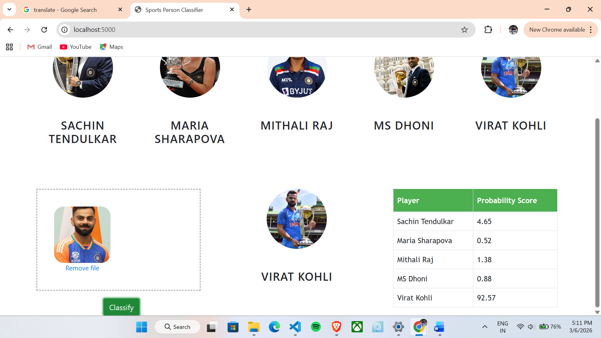
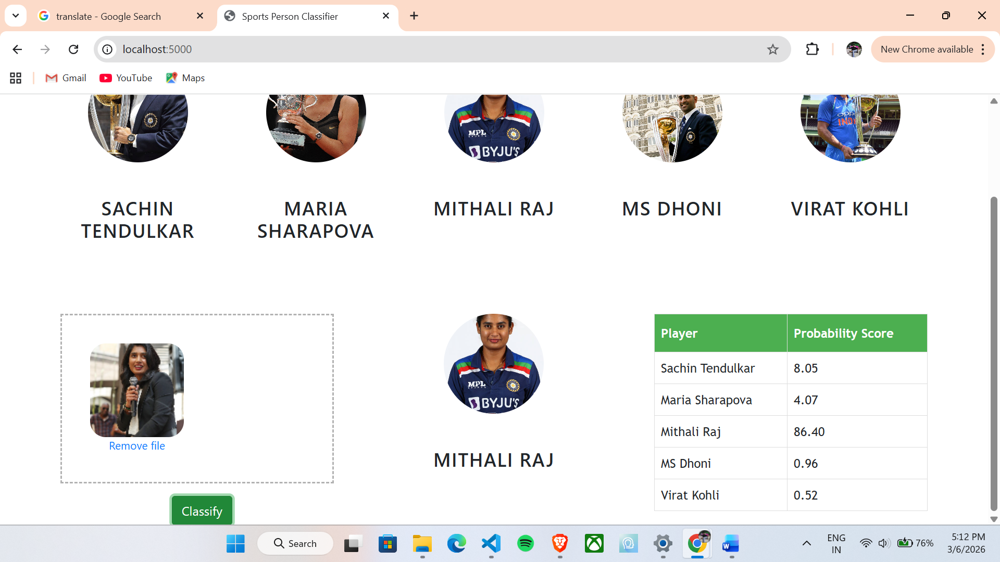
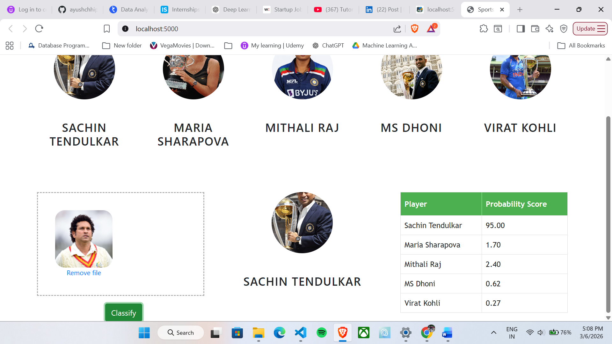

# Sports Person Image Classifier

A Machine Learning web application that identifies sports celebrities from images using **Computer Vision, Wavelet Transform, and a trained Machine Learning model**.

The application allows users to upload an image and predicts the sports personality present in the image.


---

# 📌 Project Overview

This project is an **end-to-end machine learning web application** built with Python and Flask.

The system performs:

- Face detection using OpenCV
- Eye detection for face validation
- Feature extraction using Wavelet Transform
- Classification using a trained machine learning model
- Web interface for uploading images and displaying predictions

---

# ⚙️ Tech Stack

### Programming Language
- Python

### Machine Learning
- Scikit-learn
- NumPy
- Wavelet Transform

### Computer Vision
- OpenCV

### Backend
- Flask

### Frontend
- HTML
- CSS
- JavaScript
- Dropzone.js

---

## 📂 Project Structure
```
Sport_person_classifier
│
├── README.md
├── requirements.txt
│
├── model
│ ├── dataset
│ ├── open.ui
│ └── test_image
│
├── server
│ ├── artifacts
│ │ ├── saved_model.pkl
│ │ └── class_dictionary.json
│ ├── templates
│ ├── server.py
│ ├── util.py
│ └── wavelet.py
│
└── ui
├── app.css
├── app.js
├── dropzone.min.css
├── dropzone.min.js
└── images
```
---

# 🧠 How It Works

The system follows these steps:

1. User uploads an image through the web interface.
2. Flask backend receives the image.
3. OpenCV detects faces in the image.
4. The system verifies that **two eyes are detected**.
5. The detected face is cropped.
6. Wavelet Transform extracts important facial features.
7. Raw image features and wavelet features are combined.
8. The trained machine learning model predicts the sports personality.
9. Prediction results are displayed on the webpage.

---

## 🔍 Machine Learning Pipeline
```
Input Image
↓
Face Detection (OpenCV)
↓
Eye Detection
↓
Face Cropping
↓
Wavelet Transform
↓
Feature Vector Creation
↓
ML Model Prediction
↓
Result Display
```

---

# 🚀 Installation

Clone the repository:
```bash
git clone https://github.com/ayushchhipa18/sports_person_image_classification
cd sports-person-classifier
```

Create virtual environment:
 ```bash
python3 -m venv venv
```
Activate virtual environment:
Linux / WSL
 ```bash
source venv/bin/activate
```
Windows
 ```bash
venv\Scripts\activate
```
Install dependencies:
 ```bash
pip install -r requirements.txt
```
---

# ▶️ Run the Application

Start the Flask server:
 ```bash
cd server
python server.py
 ```
Open the browser
 ```bash
http://localhost:5000
```

Upload an image and view the prediction.

---
# 📷 Example Predictions

Below are some prediction results generated by the application.

### Virat Kohli Prediction


### MS Dhoni Prediction


### Mithali Raj Prediction


### Maria Sharapova Prediction


### Sachin Tendulkar Prediction



---

# 💡 Key Features

- Face detection using OpenCV Haar Cascades
- Feature extraction using Wavelet Transform
- Machine learning classification model
- Flask backend API
- Interactive image upload interface

---

# 🔮 Future Improvements

- Use Deep Learning CNN models
- Increase dataset size
- Add real-time webcam prediction

---

# 👨‍💻 Author

Ayush Chhipa

GitHub:  
https://github.com/ayushchhipa18

